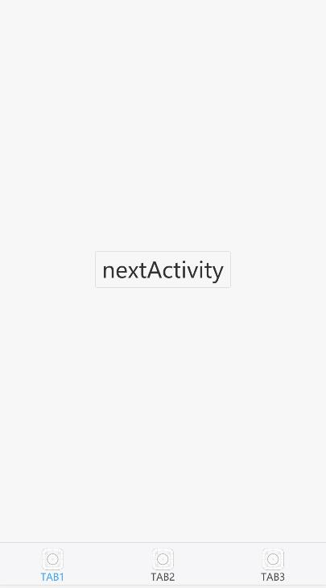
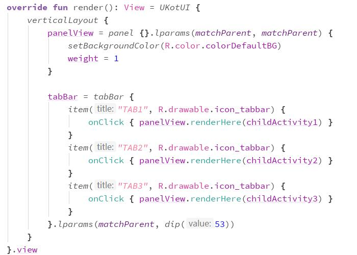

# Android-UIX-Anko

项目基于 AndroidUIX
> 移植Android的UI组件到Web端, 以Android的方式来制作高性能优体验的WebApp
>
>  例子: https://cn.uglyer.com/demo/2d/showcase/Android-UIX-Anko/index.html#  
>  
>  例子: https://cn.uglyer.com/demo/2d/showcase/widget_sample/index.html#
>
>  特点
>
>  完整Native端组件体验
>
>  使用Web Canvas绘制界面
>
>  与Android SDK相同的API，相关用法和问题都可以在网络轻易找到。

移植 Anko 至 AndroidUIX 前端项目

提供 Kotlin + Anko 编写 AndroidUIX APP 的方式

### view 



### code



### run
1. gradle sync
2. gradle runDceKotlinJs & gradle runDceTestKotlinJs
3. 访问 index.html

## Anko 的编写方式
```
verticalLayout {
    val name = editText()
    button("Say Hello") {
        onClick { toast("Hello, ${name.text}!") }
    }
}
```
更多请参考 https://github.com/Kotlin/anko/wiki/Anko-Layouts
